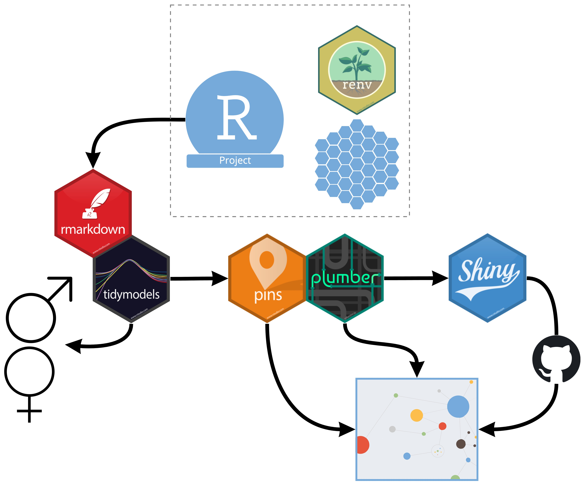

# Penguins Connect

The goal of Penguins Connect is to demonstrate an end-to-end data science workflow that is hosted on RStudio Connect. The workflow (and how to reproduce this workflow) are diagrammed above and detailed below:

1. Clone repository into a fresh RStudio Project using `Version Control`.
2. Restore the environment using `renv::restore()`.
3. R markdown document creates a model (using `tidymodels`) that predicts if a penguin is either male of female.
4. Save the model as a [Pin](https://pins.rstudio.com/) to RStudio Connect.
5. Serve the model as a plumber API and host on RStudio Connect.
6. Create a shiny app that leverages the plumber API to visualize the % breakdown of male or female given the penguin characteristics. This shiny app is published to RStudio Connect using **git-backed deployment**.

